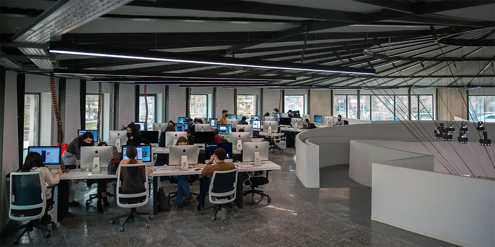

# C Piscine 42 Yerevan

This repository contains coding developed at [42 Yerevan's](https://42yerevan.am/) C bootcamp (also known as `Piscine`), from 09/oct/2023 to 02/nov/2023.

## About 42

	42 is a global education initiative that proposes a new way of learning technology: no teachers,
	no classrooms, students learning from their fellow students (peer to peer learning), with a
	methodology that develops both computing and life skills. The 42 cursus is free for whoever is
	approved in its selection process. The so-called "C Piscine", a 26-day C programming bootcamp,
	is the last stage in the selection process for becoming a "cadet" (42's student).
	

## Skills developed at C Piscine

### Hard-skills
	# C Language
		The primary language learned at the 42's Piscine is C: dealing with variables,
		pointers, memory allocation, macros, as well as creating functions and programs,
		including the use and creation of libraries and Makefiles.

	# Shell
		The first two days of the bootcamp are dedicated to learning basic to intermediate
		shell commands to seamlessly navigate through the terminal.

	# Git
		All projects are submitted via a remote git repository, which demands students to
		be at ease with such a system.

### Soft-skills
	# Self-learning and proactiveness
		At 42, self-learning is at the core of its peer to peer learning methodology. There
		are no teachers whatsoever; the learning process is based on googling, enquiring
		your classmates and empirical knowledge, each student learning at their own pace.

	# Teamwork
		On weekends, a 48h team project called "Rush" is proposed: a 3-member group randomly
		chosen by the school's system must collaboratively develop a fully running application.
		The major challenge here is to equalize the different knowledge levels while finding a
		common work methodology that allows all team members to contribute to the project.

	# Time management and resiliency
		The school is open 24/7. Thus, the so-called "pisciners" are free to work whenever
		they want, which demands excellent time management skills and resiliency for not
		"drowning" amid the massive load of work demanded by the non-stop 26-day program.

## Project Stats

|#      |PROJECT NAME           |SUBJECT                                         |EXPERIENCE |GRADE                            |
|:-----:|:---------------------:|:----------------------------------------------:|:---------:|:-------------------------------:|
|01	|[Shell 00](Shell00)    | [`EN Subject`](Shell00/Shell00_subject.pdf)	 |100 XP     |100% ✅                          |
|02	|[Shell 01](Shell01)	| [`EN Subject`](Shell01/Shell01_subject.pdf)	 |100 XP     |100% ✅                          |
|03	|[C 00](C00)	        | [`EN Subject`](C00/C00_subject.pdf)	         |100 XP     |100% ✅                          |
|04	|[C 01](C01)	        | [`EN Subject`](C01/C01_subject.pdf)	         |100 XP     |100% ✅                          |
|05	|[C 02](C02)	        | [`EN Subject`](C02/C02_subject.pdf)	         |100 XP     |100% ✅                          |
|06	|[C 03](C03)	        | [`EN Subject`](C03/C03_subject.pdf)	         |100 XP     |100% ✅                          |
|07	|[C 04](C04)	        | [`EN Subject`](C04/C04_subject.pdf)	         |100 XP     |100% ✅                          |
|08	|[C 05](C05)	        | [`EN Subject`](C05/C05_subject.pdf)	         |100 XP     |100% ✅                          |
|09	|[C 06](C06)	        | [`EN Subject`](C06/C06_subject.pdf)	         |100 XP     |100% ✅                          |
|10	|[C 07](C07)	        | [`EN Subject`](C07/C07_subject.pdf)	         |100 XP     |100% ✅                          |
|11	|[C 08](C08)	        | [`EN Subject`](C08/C08_subject.pdf)	         |100 XP     |100% ✅                          |
|12	|[C 09](C09)	        | [`EN Subject`](C09/C09_subject.pdf)	         |100 XP     |100% ✅                          |
|13	|[C 10](C10)	        | [`EN Subject`](C10/C10_subject.pdf)	         |100 XP     |(Partially Done / Not Delivered) |
|14	|[C 11](C11)	        | [`EN Subject`](C11/C11_subject.pdf)	         |100 XP     |100% ✅                          |
|15	|[C 12](C12)	        | [`EN Subject`](C12/C12_subject.pdf)	         |100 XP     |(Partially Done / Not Delivered) |
|16	|[C 13](C13)	        | [`EN Subject`](C13/C13_subject.pdf)	         |100 XP     |90% ✅                           |

